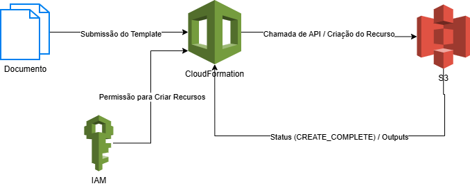

# Desafio DIO: Infraestrutura como Código (IaC) com AWS CloudFormation

Este projeto documenta a conclusão do desafio de IaC da DIO, focado em utilizar o **AWS CloudFormation** para provisionar recursos de infraestrutura de forma automatizada e repetível.

---

## 1. O Template (Código da Infraestrutura)

O código que define a infraestrutura está no arquivo **[simple-s3-stack.yaml](simple-s3-stack.yaml)**, que tem como objetivo a criação de um Bucket no Amazon S3.

### 1.1. Estrutura e Análise Detalhada (O Que Eu Aprendi)

| Elemento do YAML | Função | Meu Insight Técnico |
| :--- | :--- | :--- |
| **`Resources`** | Seção Principal | Aprendi que esta é a **única seção obrigatória** em um Template. Ela atua como um manifesto de todos os recursos que a Stack deve criar e gerenciar. |
| **`!Sub`** | Função Intrínseca | O uso do `!Sub` para incluir `${AWS::AccountId}` e `${AWS::Region}` garante que o Template é **reutilizável** e que o nome do Bucket S3 (que é global) será **único** e rastreável. |
| **`Outputs`** | Interface de Stack | Entendi que `Outputs` não apenas exibe o nome do Bucket, mas cria uma **interface** para que outras Stacks ou sistemas possam referenciar este recurso. |
| **Tags** | Metadados | Adicionar Tags (`Environment: IaC-Challenge`) é uma prática fundamental para **governança, custo e auditoria** de recursos na AWS, mesmo em um template simples. |

---

## 2. Fluxo de Trabalho (IaC Workflow)

O processo de provisionamento com CloudFormation é um ciclo de vida que garante a consistência da infraestrutura.

### 2.1. Evidência Visual (Diagrama de Fluxo)

O diagrama abaixo, criado no Draw.io, ilustra o fluxo transacional:

 .

### 2.2. A Importância da Gestão do Ciclo de Vida

O maior aprendizado teórico reside no modo como o CloudFormation gerencia as mudanças, garantindo a **integridade** do ambiente:

* **Rollback é Segurança:** Se, ao tentar criar o Bucket, o CloudFormation encontrasse uma falha (ex: falha de permissão no IAM), ele iniciaria o **Rollback**, desfazendo a operação. Isso é crucial para evitar que a infraestrutura fique em um estado incompleto e inconsistente.
* **Cleanup Automático:** Ao deletar a Stack, o serviço garante o **Cleanup** (limpeza). Ele rastreia todos os recursos que criou (neste caso, o Bucket S3) e os remove, evitando que recursos fiquem "órfãos" e gerando custos desnecessários.
* **Modelo Desejado:** O CloudFormation garante que o estado da infraestrutura **corresponda sempre ao estado declarado no Template**. Se o Template diz que o Bucket existe, ele garante que o Bucket exista.

---

## 3. Conclusão do Desafio

O desafio consolidou o entendimento de que IaC não é apenas automatizar comandos, mas sim gerenciar o **ciclo de vida completo** da infraestrutura através de um código versionável. O CloudFormation atua como a espinha dorsal para garantir que a infraestrutura seja **auditável, repetível e consistente**.

---
